# Elastic GPU Telemetry Pipeline

A scalable, elastic telemetry pipeline for AI clusters built with the Nexus framework and etcd. This system streams GPU telemetry data through a custom message queue, processes it with distributed collectors, and serves it via a multi-protocol API (REST, GraphQL, WebSocket).

## 🚀 Quick Start

### Prerequisites

- **Go 1.21+**
- **Docker & Docker Compose** 
- **etcd 3.5+**
- **Kubernetes & Helm** (for production deployment)

### Local Testing (Development)

```bash
# 1. Clone and setup
git clone <repository-url>
cd telemetry-pipeline

# 2. Install dependencies and build
make deps
make build-nexus

# 3. Start etcd (message queue & storage)
make setup-etcd

# 4. Scale pipeline to 2 instances each
INSTANCES=2 make scale-local

# 5. Test the API
curl http://localhost:8080/api/v1/gpus | jq .
curl http://localhost:8080/health

# 6. Check status and logs
make scale-status
make scale-logs
```

### Kubernetes Testing (Production)

```bash
# 1. Build Docker images
make docker-build-nexus

# 2. Deploy to Kubernetes
make k8s-deploy-nexus

# 3. Check deployment status
make k8s-status-nexus

# 4. Access the API (Multiple Options)

# Option A: Port Forward (Development/Testing)
make k8s-port-forward
# In another terminal:
curl http://localhost:8080/api/v1/gpus | jq .

# Option B: Ingress (Production - requires ingress controller)
# Edit values-nexus.yaml to enable ingress, then:
# curl https://your-domain.com/api/v1/gpus

# Option C: LoadBalancer (Cloud)
# Change service type to LoadBalancer in values-nexus.yaml
# kubectl get svc to get external IP

# 5. Scale components
STREAMER_INSTANCES=3 COLLECTOR_INSTANCES=3 make k8s-deploy-nexus

# 6. Clean up
make k8s-undeploy-nexus
```

## 🏗️ Architecture

The system consists of three main Nexus components connected via etcd:

```mermaid
graph LR
    subgraph "Data Sources"
        CSV[📄 CSV Files]
    end
    
    subgraph "Nexus Pipeline"
        S[🔄 Nexus Streamer<br/>Data Ingestion]
        E[🗄️ etcd<br/>Message Queue + Storage]
        C[⚙️ Nexus Collector<br/>Data Processing]
        G[🌐 Nexus Gateway<br/>Multi-Protocol API]
    end
    
    subgraph "Clients"
        API[📱 REST API]
        GQL[🔍 GraphQL]
        WS[🔌 WebSocket]
    end
    
    CSV --> S
    S --> E
    E --> C
    C --> E
    E --> G
    G --> API
    G --> GQL
    G --> WS
```



### Components

- **🔄 Nexus Streamer**: Reads CSV telemetry data and streams to etcd message queue
- **⚙️ Nexus Collector**: Consumes messages, processes data, and stores in etcd
- **🌐 Nexus Gateway**: Multi-protocol API server (REST + GraphQL + WebSocket)
- **🗄️ etcd**: Distributed message queue and hierarchical data storage (serves as both queue and database)
  - **Message Queue**: Temporary storage for streaming telemetry data
  - **Data Storage**: Persistent hierarchical storage for processed data  
  - **Coordination**: Distributed locks and watches for component coordination

## 📊 Complete API Reference

The Nexus Gateway provides multiple API interfaces with comprehensive telemetry access:

### 🌐 REST API Endpoints

#### Core Telemetry APIs (Required by Assignment)
```bash
# 1. List All GPUs - Return all GPUs with telemetry data available
GET /api/v1/gpus
# Response: 247 GPUs across 31 hosts

# 2. Query Telemetry by GPU - All telemetry for specific GPU, ordered by time  
GET /api/v1/gpus/{uuid}/telemetry
GET /api/v1/gpus/{uuid}/telemetry?start_time=2025-07-18T20:42:34Z&end_time=2025-07-18T20:42:36Z&limit=100

# Examples:
curl "http://localhost:8080/api/v1/gpus/GPU-75ca836f-12a0-9fbe-13a2-17733a5f68e4/telemetry"
curl "http://localhost:8080/api/v1/gpus/GPU-75ca836f-12a0-9fbe-13a2-17733a5f68e4/telemetry?limit=50"
```

#### Extended Hierarchical APIs (Nexus-style)
```bash
# Cluster Management
GET /api/v1/clusters                           # List all clusters
GET /api/v1/clusters/{cluster_id}              # Get cluster details
GET /api/v1/clusters/{cluster_id}/stats        # Cluster statistics

# Host Management  
GET /api/v1/clusters/{cluster_id}/hosts        # List hosts in cluster
GET /api/v1/clusters/{cluster_id}/hosts/{host_id}  # Host details
GET /api/v1/hosts                              # List all hosts (shortcut)

# GPU Management by Host
GET /api/v1/clusters/{cluster_id}/hosts/{host_id}/gpus     # GPUs on specific host
GET /api/v1/clusters/{cluster_id}/hosts/{host_id}/gpus/{gpu_id}  # Specific GPU details
GET /api/v1/hosts/{hostname}/gpus              # GPUs by hostname (shortcut)

# GPU Metrics & Telemetry
GET /api/v1/clusters/{cluster_id}/hosts/{host_id}/gpus/{gpu_id}/metrics  # GPU metrics
GET /api/v1/telemetry                          # Global telemetry data
GET /api/v1/telemetry/latest                   # Latest telemetry across all GPUs

# System Health
GET /health                                    # Service health check
```

#### Query Parameters (All Telemetry Endpoints)
```bash
# Time filtering (RFC3339 format)
?start_time=2025-07-18T20:42:34Z              # Filter from time (inclusive)
?end_time=2025-07-18T20:42:36Z                # Filter to time (inclusive)

# Result limiting
?limit=100                                     # Limit number of results (default: 100)

# Combined example
?start_time=2025-07-18T20:42:34Z&end_time=2025-07-18T20:42:36Z&limit=50
```

### 🔍 GraphQL API

```bash
# GraphQL endpoint
POST /graphql                                  # GraphQL queries and mutations
GET /graphql                                   # GraphQL Playground (development)

# Example queries:
{
  # Get all GPUs with basic info
  gpus {
    id
    uuid
    hostname
    name
    device
    status
  }
}

{
  # Get specific GPU with telemetry
  gpu(uuid: "GPU-75ca836f-12a0-9fbe-13a2-17733a5f68e4") {
    id
    uuid
    hostname
    name
    telemetry(limit: 10) {
      timestamp
      gpuUtilization
      memoryUtilization
      temperature
      powerDraw
    }
  }
}

{
  # Get cluster overview
  clusters {
    id
    hosts {
      hostname
      gpus {
        id
        uuid
        name
        status
      }
    }
  }
}
```

### 🔌 WebSocket API

```bash
# Real-time telemetry streaming
WS /ws

# Connection example:
wscat -c ws://localhost:8080/ws

# Subscription messages (JSON):
{
  "type": "subscribe",
  "topic": "telemetry",
  "filters": {
    "gpu_uuid": "GPU-75ca836f-12a0-9fbe-13a2-17733a5f68e4",
    "metrics": ["gpu_utilization", "temperature", "power_draw"]
  }
}

# Real-time data stream:
{
  "type": "telemetry_update",
  "timestamp": "2025-07-18T20:42:34Z",
  "gpu_uuid": "GPU-75ca836f-12a0-9fbe-13a2-17733a5f68e4",
  "data": {
    "gpu_utilization": 85.5,
    "temperature": 72.3,
    "power_draw": 320.1
  }
}
```

### 📚 API Documentation

```bash
# OpenAPI/Swagger Documentation
GET /swagger/                                  # Interactive API documentation
GET /docs                                      # Redirect to Swagger UI

# API Specification Files  
GET /swagger/swagger.json                      # OpenAPI 3.0 JSON spec
GET /swagger/swagger.yaml                      # OpenAPI 3.0 YAML spec
```

### 🧪 API Testing Examples

```bash
# Test core APIs (assignment requirements)
curl -s http://localhost:8080/api/v1/gpus | jq '.count'
curl -s http://localhost:8080/api/v1/gpus | jq '.data[0]'
curl -s "http://localhost:8080/api/v1/gpus/GPU-75ca836f-12a0-9fbe-13a2-17733a5f68e4/telemetry?limit=5" | jq .

# Test extended APIs
curl -s http://localhost:8080/api/v1/hosts | jq .
curl -s http://localhost:8080/api/v1/telemetry/latest | jq .

# Test GraphQL
curl -X POST http://localhost:8080/graphql \
  -H "Content-Type: application/json" \
  -d '{"query": "{ gpus { id uuid hostname name } }"}'

# Test WebSocket (requires wscat: npm install -g wscat)
wscat -c ws://localhost:8080/ws

# Health check
curl -s http://localhost:8080/health | jq .
```

### 📊 Response Examples

#### GPU List Response
```json
{
  "success": true,
  "count": 247,
  "data": [
    {
      "id": "0",
      "uuid": "GPU-75ca836f-12a0-9fbe-13a2-17733a5f68e4",
      "hostname": "mtv5-dgx1-hgpu-032",
      "name": "NVIDIA H100 80GB HBM3",
      "device": "nvidia0",
      "status": "active"
    }
  ]
}
```

#### Telemetry Data Response
```json
{
  "success": true,
  "count": 4,
  "data": [
    {
      "telemetry_id": "mtv5-dgx1-hgpu-032_0_1752871354",
      "timestamp": "2025-07-18T20:42:34Z",
      "gpu_id": "0",
      "uuid": "GPU-75ca836f-12a0-9fbe-13a2-17733a5f68e4",
      "device": "nvidia0",
      "model_name": "NVIDIA H100 80GB HBM3",
      "hostname": "mtv5-dgx1-hgpu-032",
      "gpu_utilization": 85.5,
      "memory_utilization": 78.2,
      "memory_used_mb": 62560,
      "memory_free_mb": 17920,
      "temperature": 72.3,
      "power_draw": 320.1,
      "sm_clock_mhz": 1980,
      "memory_clock_mhz": 2619
    }
  ]
}
```

## 🔧 Local Development

### Environment Setup

```bash
# Start etcd
make setup-etcd

# Build all components
make build-nexus

# Run individual components
make run-nexus-streamer    # Terminal 1
make run-nexus-collector   # Terminal 2  
make run-nexus-gateway     # Terminal 3
```

### Scaling Components

```bash
# Scale all components
INSTANCES=3 make scale-local

# Scale individual components
STREAMER_INSTANCES=5 make scale-streamers
COLLECTOR_INSTANCES=3 make scale-collectors
API_GW_INSTANCES=2 make scale-gateways

# Monitor scaled components
make scale-status
make scale-logs

# Stop all scaled components
make scale-stop
```

### Testing & Verification

```bash
# Verify record processing (2470 records)
./scripts/verify-record-count.sh

# Test time-based queries
./scripts/test-time-queries.sh

# Run comprehensive demo
./scripts/demo-scaling.sh

# Test multiple gateway instances
for port in 8080 8081 8082; do
  curl -s http://localhost:$port/health | jq .status
done
```

### Development Workflow

```bash
# 1. Make changes to code
# 2. Rebuild components
make build-nexus

# 3. Restart scaled components
make scale-stop
INSTANCES=2 make scale-local

# 4. Test changes
curl http://localhost:8080/api/v1/gpus | jq '.count'

# 5. Check logs for issues
tail -f logs/*.log | grep -i error
```

## 🚀 Kubernetes Deployment

### Prerequisites

```bash
# Verify prerequisites
kubectl version --client
helm version
docker --version

# Check cluster connection
kubectl cluster-info
```

### Deployment Steps

```bash
# 1. Build and tag Docker images
make docker-build-nexus

# 2. Push to registry (if needed)
DOCKER_REGISTRY=your-registry.com make docker-push-nexus

# 3. Deploy with default scaling (2 instances each)
make k8s-deploy-nexus

# 4. Deploy with custom scaling
NAMESPACE=telemetry-prod \
STREAMER_INSTANCES=5 \
COLLECTOR_INSTANCES=3 \
API_GW_INSTANCES=2 \
make k8s-deploy-nexus
```

### Kubernetes Management

```bash
# Check deployment status
make k8s-status-nexus
kubectl get pods -n telemetry-system

# View logs
make k8s-logs-nexus
kubectl logs -f deployment/telemetry-pipeline-nexus-gateway -n telemetry-system
```

### Accessing the API in Kubernetes

**Why do we need port-forward?** Kubernetes services run inside the cluster network and aren't directly accessible from your local machine by default.

#### Option 1: Port Forward (Development/Testing)
```bash
# Create secure tunnel: localhost:8080 → cluster service:8080
make k8s-port-forward

# Test in another terminal:
curl http://localhost:8080/api/v1/gpus | jq .
```
✅ **Pros**: Simple, secure, works immediately  
❌ **Cons**: Only for development, temporary, single user

#### Option 2: Ingress (Production)
```yaml
# Enable in values-nexus.yaml:
nexusGateway:
  ingress:
    enabled: true
    hosts:
      - host: telemetry-api.company.com
        paths:
          - path: /
            pathType: Prefix
```
```bash
# Deploy with ingress:
make k8s-deploy-nexus

# Access via domain:
curl https://telemetry-api.company.com/api/v1/gpus
```
✅ **Pros**: Production-ready, multiple users, proper DNS  
❌ **Cons**: Requires ingress controller setup

#### Option 3: LoadBalancer (Cloud)
```yaml
# Change in values-nexus.yaml:
nexusGateway:
  service:
    type: LoadBalancer
```
```bash
# Get external IP:
kubectl get svc telemetry-pipeline-nexus-gateway -n telemetry-system

# Access via external IP:
curl http://<EXTERNAL_IP>:8080/api/v1/gpus
```
✅ **Pros**: Automatic external access  
❌ **Cons**: Cloud-specific, costs money

#### Option 4: NodePort (Testing)
```yaml
# Change in values-nexus.yaml:
nexusGateway:
  service:
    type: NodePort
```
```bash
# Get node IP and port:
kubectl get nodes -o wide
kubectl get svc telemetry-pipeline-nexus-gateway -n telemetry-system

# Access via node:
curl http://<NODE_IP>:<NODE_PORT>/api/v1/gpus
```
✅ **Pros**: Works without ingress controller  
❌ **Cons**: Exposes service on all cluster nodes

### Continued Management

```bash

# Scale deployments
kubectl scale deployment telemetry-pipeline-nexus-streamer --replicas=5 -n telemetry-system

# Update deployment
helm upgrade telemetry-pipeline deployments/helm/telemetry-pipeline \
  --namespace telemetry-system \
  --values deployments/helm/telemetry-pipeline/values-nexus.yaml \
  --set nexusStreamer.replicaCount=5

# Clean up
make k8s-undeploy-nexus
```

### Production Configuration

```yaml
# values-production.yaml
nexusStreamer:
  replicaCount: 5
  resources:
    limits:
      cpu: 1000m
      memory: 1Gi
    requests:
      cpu: 500m
      memory: 512Mi

nexusCollector:
  replicaCount: 3
  resources:
    limits:
      cpu: 2000m
      memory: 2Gi
    requests:
      cpu: 1000m
      memory: 1Gi

nexusGateway:
  replicaCount: 2
  resources:
    limits:
      cpu: 1000m
      memory: 1Gi
  ingress:
    enabled: true
    hosts:
      - host: telemetry-api.company.com
        paths:
          - path: /
            pathType: Prefix

etcd:
  replicaCount: 3
  persistence:
    enabled: true
    size: 20Gi
```

## 📈 Performance & Scaling

### Current Capacity

- **247 GPUs** across **31 hosts** supported
- **2,470 telemetry records** processed from CSV
- **Multiple protocol support**: REST, GraphQL, WebSocket
- **Horizontal scaling**: 2-10 instances per component

### Scaling Guidelines

| Component | Min | Max | CPU/Instance | Memory/Instance |
|-----------|-----|-----|--------------|-----------------|
| Streamer  | 1   | 10  | 100-500m     | 128-512Mi       |
| Collector | 1   | 10  | 200-1000m    | 256Mi-1Gi       |
| Gateway   | 2   | 5   | 200-1000m    | 256Mi-1Gi       |

### Performance Testing

```bash
# Load test API endpoints
ab -n 1000 -c 10 http://localhost:8080/api/v1/gpus

# Test WebSocket connections
wscat -c ws://localhost:8080/ws

# Monitor resource usage
htop -p $(pgrep nexus | tr '\n' ',' | sed 's/,$//')

# Test scaling under load
INSTANCES=5 make scale-local
# Run load tests in parallel
```

## 🔍 Monitoring & Debugging

### Health Monitoring

```bash
# Component health
make scale-status                    # Local scaling status
make k8s-status-nexus               # Kubernetes status

# API health
curl http://localhost:8080/health
curl http://localhost:8081/health   # Multiple gateways

# etcd health
etcdctl --endpoints=localhost:2379 endpoint health
```

### Log Analysis

```bash
# Local logs
make scale-logs                     # Follow all logs
tail -f logs/streamer-*.log        # Streamer logs
tail -f logs/collector-*.log       # Collector logs
tail -f logs/gateway-*.log         # Gateway logs

# Kubernetes logs
make k8s-logs-nexus                # All component logs
kubectl logs -f -l app.kubernetes.io/component=nexus-streamer -n telemetry-system
```

### Common Issues

```bash
# Check etcd connectivity
etcdctl --endpoints=localhost:2379 get --prefix "/telemetry/" --keys-only | wc -l

# Verify data processing
./scripts/verify-record-count.sh

# Debug API responses
curl -v http://localhost:8080/api/v1/gpus | jq .

# Check resource usage
top -p $(pgrep nexus)
kubectl top pods -n telemetry-system
```

## 🛠️ Development Commands

### Build & Test

```bash
make help                          # Show all available commands
make deps                          # Install dependencies
make build-nexus                   # Build all Nexus components
make test                          # Run tests
make lint                          # Run linter
make generate-swagger              # Generate OpenAPI spec
```

### Docker Operations

```bash
make docker-build-nexus            # Build Docker images
make docker-push-nexus             # Push to registry
make docker-build-legacy           # Build legacy images (deprecated)
```

### Local Environment

```bash
make setup-etcd                    # Start etcd
make scale-local INSTANCES=3       # Scale all components
make scale-streamers STREAMER_INSTANCES=5  # Scale streamers only
make scale-status                  # Check component status
make scale-stop                    # Stop all components
```

### Kubernetes Operations

```bash
make k8s-deploy-nexus             # Deploy to Kubernetes
make k8s-status-nexus             # Check K8s status
make k8s-logs-nexus               # View K8s logs
make k8s-port-forward             # Port forward to API
make k8s-undeploy-nexus           # Remove from K8s
```

## 📚 Documentation

- **[Architecture Guide](docs/ARCHITECTURE.md)** - System design and components
- **[Scaling & Kubernetes](docs/SCALING_AND_KUBERNETES.md)** - Deployment and scaling
- **[API Specification](docs/API_SPECIFICATION.md)** - REST API documentation
- **[Debugging Guide](docs/DEBUGGING.md)** - Troubleshooting and debugging
- **[Nexus Integration](docs/NEXUS_INTEGRATION_GUIDE.md)** - Nexus framework details
- **[etcd Message Queue](docs/ETCD_MESSAGE_QUEUE.md)** - How etcd functions as a message queue

## 🔒 Security

### Local Development
- Non-root containers
- Secure etcd configuration
- Network isolation

### Production
- RBAC for Kubernetes
- Network policies
- TLS encryption
- Secret management

## 🤝 Contributing

### Development Setup

```bash
# 1. Fork and clone
git clone <your-fork>
cd telemetry-pipeline

# 2. Install development tools
make deps

# 3. Run tests
make test
make lint

# 4. Test locally
make setup-etcd
INSTANCES=2 make scale-local
```

### Testing Changes

```bash
# Test local changes
make build-nexus
make scale-stop
INSTANCES=2 make scale-local
curl http://localhost:8080/api/v1/gpus | jq .

# Test Kubernetes deployment
make docker-build-nexus
NAMESPACE=telemetry-dev make k8s-deploy-nexus
```

## 📄 License

[Add your license information here]

## 🆘 Support

For issues and questions:

1. **Check the [Debugging Guide](docs/DEBUGGING.md)** for common solutions
2. **Review logs**: `make scale-logs` or `make k8s-logs-nexus`
3. **Collect system info** and logs when reporting issues
4. **Include reproduction steps** in issue reports

### Quick Troubleshooting

```bash
# Complete health check
make scale-status && \
curl -s http://localhost:8080/health | jq . && \
etcdctl --endpoints=localhost:2379 endpoint health

# Reset everything
make scale-stop
make setup-etcd
INSTANCES=2 make scale-local
```

---

**🚀 Ready to get started?** Run `INSTANCES=2 make scale-local` and visit http://localhost:8080/api/v1/gpus