# System Architecture

## Overview

The Elastic GPU Telemetry Pipeline is designed as a distributed system with four main components that work together to ingest, process, and serve GPU telemetry data from AI clusters.

## Core Components

### 1. Telemetry Streamer
**Purpose**: Reads telemetry from CSV files and streams it periodically over the custom message queue.

**Key Features**:
- CSV file parsing and validation
- Batch processing for optimal throughput
- Loop mode for continuous streaming simulation
- Dynamic scaling support (up to 10 instances)
- HTTP endpoint for CSV file uploads

### 2. Telemetry Collector
**Purpose**: Consumes telemetry from the custom message queue, parses and persists it.

**Key Features**:
- Message queue consumption with polling
- Concurrent data processing workers
- Automatic host and GPU registration
- Dynamic scaling support (up to 10 instances)
- Graceful error handling and retry logic

### 3. API Gateway
**Purpose**: REST API exposing telemetry data with auto-generated OpenAPI specification.

**Key Features**:
- RESTful API endpoints per specification
- Auto-generated OpenAPI/Swagger documentation
- Time-based filtering and pagination
- GraphQL and WebSocket support
- CORS and security middleware

### 4. Custom Message Queue
**Purpose**: Messaging system connecting streamers with collectors, implemented using etcd.

**Key Features**:
- Pub/Sub messaging pattern
- Persistent message storage
- Atomic message operations
- Horizontal scaling support
- High availability with etcd clustering

## System Architecture Diagram

```mermaid
graph TB
    subgraph "Data Sources"
        CSV["📄 CSV Files<br/>GPU Telemetry Data"]
    end
    
    subgraph "Telemetry Pipeline"
        subgraph "Nexus Streamer"
            NS["🔄 Nexus Streamer<br/>Port: 8081<br/>• CSV Upload API<br/>• Data Validation<br/>• Batch Processing"]
        end
        
        subgraph "etcd Message Queue + Storage"
            ETCD["🗄️ etcd Cluster<br/>• Message Queue<br/>• Data Storage<br/>• High Availability"]
            
            subgraph "Message Flow"
                MQ["📨 Message Queue<br/>/messagequeue/telemetry/"]
                DS["💾 Data Storage<br/>/telemetry/clusters/"]
            end
        end
        
        subgraph "Nexus Collector"
            NC["⚙️ Nexus Collector<br/>• Message Processing<br/>• Data Persistence<br/>• GPU Registration"]
        end
        
        subgraph "Nexus Gateway"
            NG["🌐 Nexus Gateway<br/>Port: 8080<br/>• REST API<br/>• GraphQL<br/>• WebSocket"]
        end
    end
    
    subgraph "Client Applications"
        API["🔌 REST Clients"]
        GQL["📊 GraphQL Clients"]
        WS["⚡ WebSocket Clients"]
        SWAGGER["📚 Swagger UI<br/>/swagger/"]
    end
    
    %% Data Flow
    CSV --> NS
    NS --> MQ
    MQ --> NC
    NC --> DS
    DS --> NG
    
    %% API Connections
    NG --> API
    NG --> GQL
    NG --> WS
    NG --> SWAGGER
    
    %% etcd Internal
    MQ -.-> ETCD
    DS -.-> ETCD
    
    %% Scaling Indicators
    NS -.- NS1["📈 Up to 10 instances"]
    NC -.- NC1["📈 Up to 10 instances"]
    NG -.- NG1["📈 Load balanced"]
    
    %% Styling
    classDef streamer fill:#e1f5fe
    classDef collector fill:#f3e5f5
    classDef gateway fill:#e8f5e8
    classDef etcd fill:#fff3e0
    classDef client fill:#fce4ec
    
    class NS,NS1 streamer
    class NC,NC1 collector
    class NG,NG1 gateway
    class ETCD,MQ,DS etcd
    class API,GQL,WS,SWAGGER client
```



## Data Flow

### 1. Data Ingestion Flow
```
CSV Files → Nexus Streamer → etcd Message Queue → Nexus Collector → etcd Storage
```

### 2. Query Flow
```
Client Request → Nexus Gateway → etcd Data Query → Response Formatting → Client Response
```

## Message Queue Design

### etcd-Based Implementation

**Key Structure**:
```
/telemetry/queue/{cluster-id}/{timestamp}_{hostname}_{gpu_id}_{sequence}
```

**Message Format**:
```json
{
  "timestamp": "2024-01-15T10:30:00Z",
  "gpu_id": "0",
  "hostname": "gpu-node-01",
  "uuid": "GPU-12345",
  "device": "nvidia0",
  "model_name": "NVIDIA H100 80GB HBM3",
  "gpu_utilization": 85.5,
  "memory_utilization": 70.2,
  "temperature": 65.0,
  "power_draw": 350.5
}
```

## Scaling Architecture

### Horizontal Scaling (Up to 10 instances each)

**Streamer Scaling**: Multiple streamers can process different CSV files
**Collector Scaling**: Multiple collectors consume from shared message queue  
**Gateway Scaling**: Stateless API servers for easy horizontal scaling

## Performance Characteristics

### Throughput Targets
- **Streamer**: 10,000+ records/second per instance
- **Collector**: 5,000+ records/second per instance
- **Gateway**: 1,000+ API requests/second per instance

### Latency Targets
- **End-to-End**: <100ms for data ingestion to availability
- **API Response**: <50ms for simple queries
- **Message Processing**: <10ms per message
