# Telemetry Pipeline Architecture

## Overview

The Elastic GPU Telemetry Pipeline is a scalable, distributed system designed to collect, process, and serve GPU telemetry data from AI clusters. The system uses the Nexus framework and etcd as the backbone for reliable data processing and storage.

## 🏗️ System Architecture

### High-Level Components

```mermaid
graph TB
    subgraph "Data Sources"
        CSV[📄 CSV Files<br/>Telemetry Data]
        GPU[🖥️ GPU Metrics<br/>Real-time Data]
    end
    
    subgraph "Nexus Telemetry Pipeline"
        subgraph "Data Ingestion Layer"
            NS1[🔄 Nexus Streamer 1]
            NS2[🔄 Nexus Streamer 2]
            NSN[🔄 Nexus Streamer N]
        end
        
        subgraph "Message Queue & Storage"
            ETCD[🗄️ etcd Cluster<br/>Message Queue + Data Store]
        end
        
        subgraph "Data Processing Layer"
            NC1[⚙️ Nexus Collector 1]
            NC2[⚙️ Nexus Collector 2]
            NCN[⚙️ Nexus Collector N]
        end
        
        subgraph "API Layer"
            NG1[🌐 Nexus Gateway 1<br/>REST + GraphQL + WebSocket]
            NG2[🌐 Nexus Gateway 2<br/>REST + GraphQL + WebSocket]
            LB[⚖️ Load Balancer]
        end
    end
    
    subgraph "Clients"
        WEB[🖥️ Web Dashboard]
        API[📱 API Clients]
        CLI[💻 CLI Tools]
    end
    
    CSV --> NS1
    CSV --> NS2
    CSV --> NSN
    GPU --> NS1
    
    NS1 --> ETCD
    NS2 --> ETCD
    NSN --> ETCD
    
    ETCD --> NC1
    ETCD --> NC2
    ETCD --> NCN
    
    NC1 --> ETCD
    NC2 --> ETCD
    NCN --> ETCD
    
    ETCD --> NG1
    ETCD --> NG2
    
    NG1 --> LB
    NG2 --> LB
    
    LB --> WEB
    LB --> API
    LB --> CLI
```



### Component Details

#### 🔄 Nexus Streamer
- **Purpose**: Data ingestion and streaming
- **Responsibilities**:
  - Read telemetry data from CSV files
  - Parse and validate data format
  - Stream data to etcd message queue
  - Handle data batching and rate limiting
- **Scaling**: Horizontal scaling with multiple instances
- **Key Features**:
  - Configurable batch sizes
  - Multiple data source support (CSV, API, files)
  - Fault tolerance and retry mechanisms
  - Unique instance identification

#### ⚙️ Nexus Collector
- **Purpose**: Data processing and persistence
- **Responsibilities**:
  - Consume messages from etcd queue
  - Process and enrich telemetry data
  - Register GPU and host information
  - Store processed data in etcd
- **Scaling**: Horizontal scaling with multiple instances
- **Key Features**:
  - Parallel processing capabilities
  - GPU metadata management
  - Data validation and enrichment
  - Nexus framework integration

#### 🌐 Nexus Gateway
- **Purpose**: Multi-protocol API server
- **Responsibilities**:
  - Serve REST API endpoints
  - Provide GraphQL interface
  - Handle WebSocket connections
  - Load balance across instances
- **Scaling**: Horizontal scaling with load balancing
- **Key Features**:
  - Multi-protocol support (REST/GraphQL/WebSocket)
  - Auto-generated OpenAPI documentation
  - Real-time data streaming
  - Health monitoring and metrics

#### 🗄️ etcd Cluster
- **Purpose**: Distributed message queue and data store
- **Responsibilities**:
  - Message queue for component communication
  - Hierarchical data storage
  - Distributed coordination
  - Configuration management
- **Scaling**: Multi-node cluster for high availability
- **Key Features**:
  - ACID transactions
  - Watch-based notifications
  - Consistent data replication
  - Built-in clustering

## 📊 Data Flow Architecture

### Data Processing Pipeline


### Data Storage Schema

#### Hierarchical Key Structure in etcd

```
/telemetry/clusters/{cluster_id}/
├── hosts/{hostname}/
│   ├── gpus/{gpu_id}/
│   │   ├── metadata                    # GPU registration info
│   │   └── data/{telemetry_id}        # Individual telemetry records
│   └── metadata                       # Host information
└── config/                           # Cluster configuration
```

#### Data Models

**TelemetryGPU**:
```go
type TelemetryGPU struct {
    GPUID         string            `json:"gpu_id"`         // Host-specific ID (0,1,2,3...)
    UUID          string            `json:"uuid"`           // Globally unique identifier
    Device        string            `json:"device"`         // Device name (nvidia0, nvidia1...)
    DeviceName    string            `json:"device_name"`    // GPU model (NVIDIA H100 80GB HBM3)
    DriverVersion string            `json:"driver_version"`
    CudaVersion   string            `json:"cuda_version"`
    MemoryTotal   int32             `json:"memory_total_mb"`
    Properties    map[string]string `json:"properties"`
    CreatedAt     time.Time         `json:"created_at"`
    UpdatedAt     time.Time         `json:"updated_at"`
    Status        GPUStatus         `json:"status"`
}
```

**TelemetryData**:
```go
type TelemetryData struct {
    TelemetryID       string    `json:"telemetry_id"`
    Timestamp         time.Time `json:"timestamp"`
    GPUID             string    `json:"gpu_id"`
    UUID              string    `json:"uuid"`
    Device            string    `json:"device"`
    ModelName         string    `json:"model_name"`
    Hostname          string    `json:"hostname"`
    GPUUtilization    float32   `json:"gpu_utilization"`
    MemoryUtilization float32   `json:"memory_utilization"`
    MemoryUsedMB      float32   `json:"memory_used_mb"`
    MemoryFreeMB      float32   `json:"memory_free_mb"`
    Temperature       float32   `json:"temperature"`
    PowerDraw         float32   `json:"power_draw"`
    SMClockMHz        float32   `json:"sm_clock_mhz"`
    MemoryClockMHz    float32   `json:"memory_clock_mhz"`
    // ... additional metrics
}
```

## 🔧 Technology Stack

### Core Technologies
- **Language**: Go 1.21+
- **Framework**: Nexus (Intel internal framework)
- **Message Queue**: etcd v3
- **Data Storage**: etcd (hierarchical key-value)
- **API Framework**: Echo (HTTP), graphql-go (GraphQL)
- **Containerization**: Docker
- **Orchestration**: Kubernetes
- **Package Management**: Helm

### External Dependencies
- **etcd**: Distributed key-value store and message queue
- **Nexus Framework**: Service mesh and data management
- **Docker**: Container runtime
- **Kubernetes**: Container orchestration
- **Helm**: Package management for Kubernetes

## 🚀 Deployment Architectures

### Local Development


### Kubernetes Production


## 🔄 Scaling Patterns

### Horizontal Scaling

**Streamers**: 
- Scale based on data ingestion rate
- Each instance processes different data sources
- No coordination required between instances

**Collectors**:
- Scale based on processing load
- Automatic load balancing via etcd watch
- Parallel processing of different message batches

**Gateways**:
- Scale based on API request load
- Load balancing via Kubernetes Service
- Stateless design enables easy scaling

### Vertical Scaling
- Increase CPU/memory for individual components
- Useful for high-throughput scenarios
- Configure via Kubernetes resource limits

### Auto-scaling
- Horizontal Pod Autoscaler (HPA) support
- CPU and memory-based scaling triggers
- Custom metrics scaling (queue depth, API latency)

## 🔒 Security Architecture

### Authentication & Authorization
- Service-to-service authentication via Nexus framework
- RBAC support for Kubernetes deployments
- API key authentication for external clients

### Network Security
- Network policies for pod-to-pod communication
- TLS encryption for all inter-service communication
- Ingress controller with SSL termination

### Data Security
- Encryption at rest in etcd
- Encryption in transit for all communications
- Secure handling of sensitive telemetry data

## 📈 Performance Characteristics

### Throughput
- **Streamers**: 10,000+ records/second per instance
- **Collectors**: 5,000+ records/second per instance
- **Gateways**: 1,000+ API requests/second per instance

### Latency
- **End-to-end latency**: < 100ms (ingestion to API)
- **API response time**: < 50ms (95th percentile)
- **Data processing**: < 10ms per record

### Scalability Limits
- **Horizontal scaling**: 50+ instances per component
- **Data retention**: Configurable (7-90 days)
- **Concurrent connections**: 10,000+ WebSocket connections

## 🔍 Monitoring & Observability

### Metrics
- Component-level metrics (CPU, memory, throughput)
- Application metrics (processing rates, error rates)
- Infrastructure metrics (etcd performance, network)

### Logging
- Structured logging with configurable levels
- Centralized log aggregation
- Correlation IDs for request tracing

### Health Checks
- Liveness and readiness probes
- Dependency health monitoring
- Automatic failover and recovery

## 🔧 Configuration Management

### Environment Variables
- Component-specific configuration
- Runtime parameter tuning
- Feature flags and toggles

### ConfigMaps
- Kubernetes-native configuration
- Hot-reloading capabilities
- Environment-specific settings

### Secrets Management
- Secure credential storage
- Automatic secret rotation
- Integration with external secret stores

## 🏆 Design Principles

### Reliability
- Fault tolerance and graceful degradation
- Automatic retry mechanisms
- Circuit breaker patterns

### Scalability
- Horizontal scaling by design
- Stateless component architecture
- Efficient resource utilization

### Maintainability
- Clear separation of concerns
- Comprehensive documentation
- Automated testing and validation

### Performance
- Optimized data structures
- Efficient serialization
- Connection pooling and reuse
