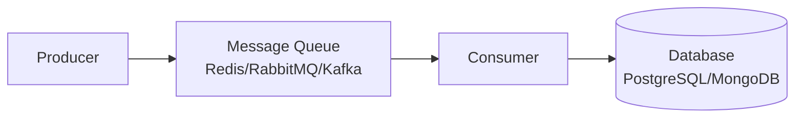
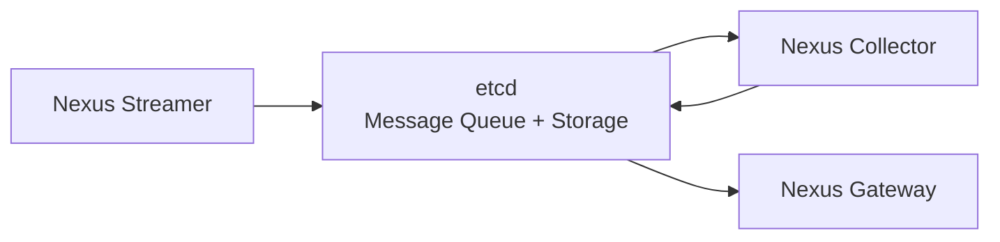

# How etcd Functions as a Message Queue

## Overview

In our telemetry pipeline, **etcd serves as both a message queue and data storage backend**. This is a unique architectural choice that provides several advantages over traditional message queue systems like Redis, RabbitMQ, or Kafka.

## 🔄 Traditional Message Queue vs etcd

### Traditional Message Queue Pattern


### Our etcd-Based Pattern


**Key Difference**: etcd serves as **both** the message queue AND the final data storage, eliminating the need for a separate database.

## 🏗️ How etcd Works as a Message Queue

### 1. Message Publishing (Streamer → etcd)

```go
// Nexus Streamer publishes telemetry records to etcd
func (ns *NexusStreamer) publishToQueue(record *TelemetryRecord) error {
    // Create unique message key with timestamp
    messageKey := fmt.Sprintf("/messagequeue/telemetry/%d_%s_%d", 
        time.Now().UnixNano(),
        record.GPUID, 
        time.Now().Unix())
    
    // Serialize record to JSON
    data, _ := json.Marshal(record)
    
    // Store in etcd with TTL (Time To Live)
    lease, _ := etcdClient.Grant(ctx, 3600) // 1 hour TTL
    etcdClient.Put(ctx, messageKey, string(data), clientv3.WithLease(lease.ID))
    
    return nil
}
```

**Key Structure:**
```
/messagequeue/telemetry/1755871354123456789_0_1755871354
/messagequeue/telemetry/1755871354123456790_1_1755871354
/messagequeue/telemetry/1755871354123456791_2_1755871354
```

### 2. Message Consumption (etcd → Collector)

```go
// Nexus Collector consumes messages from etcd
func (nc *NexusCollector) consumeFromQueue() ([]*TelemetryRecord, error) {
    queueKey := "/messagequeue/telemetry"
    
    // Get messages sorted by timestamp (oldest first)
    resp, err := nc.etcdClient.Get(ctx, queueKey+"/", 
        clientv3.WithPrefix(),
        clientv3.WithSort(clientv3.SortByKey, clientv3.SortAscend),
        clientv3.WithLimit(50)) // Batch size
    
    var records []*TelemetryRecord
    for _, kv := range resp.Kvs {
        var record TelemetryRecord
        json.Unmarshal(kv.Value, &record)
        records = append(records, &record)
        
        // Delete message after processing (acknowledgment)
        nc.etcdClient.Delete(ctx, string(kv.Key))
    }
    
    return records, nil
}
```

### 3. Data Storage (Collector → etcd)

After processing, the collector stores data in a different etcd namespace:

```go
// Store processed telemetry data
func (nc *NexusCollector) storeData(record *TelemetryRecord) error {
    // Store in hierarchical structure
    dataKey := fmt.Sprintf("/telemetry/clusters/%s/hosts/%s/gpus/%s/data/%s", 
        clusterID, record.Hostname, record.GPUID, telemetryID)
    
    telemetryData := &nexus.TelemetryData{...}
    data, _ := json.Marshal(telemetryData)
    
    etcdClient.Put(ctx, dataKey, string(data))
    return nil
}
```

## 🗄️ etcd Key Structure

### Message Queue Keys (Temporary)
```
/messagequeue/
├── telemetry/
│   ├── 1755871354123456789_0_1755871354    # Message 1
│   ├── 1755871354123456790_1_1755871354    # Message 2
│   └── 1755871354123456791_2_1755871354    # Message 3
```

### Data Storage Keys (Persistent)
```
/telemetry/clusters/local-cluster/
├── hosts/mtv5-dgx1-hgpu-032/
│   ├── gpus/0/
│   │   ├── metadata                        # GPU info
│   │   └── data/telemetry_id_123456789    # Telemetry data
│   └── gpus/1/
│       ├── metadata
│       └── data/telemetry_id_123456790
```

## ⚡ Key Features of etcd as Message Queue

### 1. **Ordered Processing**
```bash
# Messages are automatically ordered by timestamp in key
etcdctl get --prefix "/messagequeue/telemetry/" --sort-by=key
```

### 2. **Atomic Operations**
```go
// Atomic consume-and-delete operation
txnResp, err := etcdClient.Txn(ctx).
    If(clientv3.Compare(clientv3.Value(messageKey), "!=", "")).
    Then(clientv3.OpDelete(messageKey)).
    Commit()
```

### 3. **TTL (Time To Live)**
```go
// Messages auto-expire to prevent queue buildup
lease, _ := etcdClient.Grant(ctx, 3600) // 1 hour
etcdClient.Put(ctx, messageKey, data, clientv3.WithLease(lease.ID))
```

### 4. **Watch-Based Notifications**
```go
// Real-time notifications when new messages arrive
watchChan := etcdClient.Watch(ctx, "/messagequeue/telemetry/", clientv3.WithPrefix())
for watchResp := range watchChan {
    for _, event := range watchResp.Events {
        if event.Type == clientv3.EventTypePut {
            // New message available
            processMessage(event.Kv)
        }
    }
}
```

### 5. **Distributed Coordination**
```go
// Multiple collectors can coordinate using etcd locks
session, _ := concurrency.NewSession(etcdClient)
mutex := concurrency.NewMutex(session, "/locks/message-processing")

mutex.Lock(ctx)
// Process messages exclusively
mutex.Unlock(ctx)
```

## 🚀 Advantages of etcd as Message Queue

### 1. **Unified Storage**
- **Single System**: etcd serves as both queue and database
- **No Data Movement**: Messages transform into stored data without copying
- **Consistency**: ACID transactions across queue and storage

### 2. **Reliability**
- **Persistence**: Messages survive crashes (unlike in-memory queues)
- **Replication**: Multi-node etcd cluster provides high availability
- **Consistency**: Strong consistency guarantees

### 3. **Scalability**
- **Horizontal Scaling**: Multiple collectors can process different message ranges
- **Efficient Querying**: Range queries for time-based message processing
- **Watch Mechanism**: Real-time notifications without polling

### 4. **Operational Simplicity**
- **One System to Manage**: No separate queue + database setup
- **Unified Monitoring**: Single system to monitor and debug
- **Backup/Restore**: One system to backup

## 📊 Performance Characteristics

### Throughput
```bash
# etcd can handle:
- 10,000+ writes/second (message publishing)
- 50,000+ reads/second (message consumption)
- 1,000+ transactions/second (atomic operations)
```

### Latency
```bash
# Typical latencies:
- Message publish: 1-5ms
- Message consume: 1-3ms
- Watch notification: <1ms
```

### Storage Efficiency
```bash
# Automatic cleanup:
- TTL removes processed messages
- Compaction reclaims space
- No manual queue maintenance needed
```

## 🔍 Message Flow Example

Let's trace a telemetry record through the system:

### Step 1: Streamer Publishes
```bash
# Streamer reads CSV and publishes to etcd
Key: /messagequeue/telemetry/1755871354123456789_0_1755871354
Value: {"timestamp":"2025-07-18T20:42:34Z","gpu_id":"0","hostname":"mtv5-dgx1-hgpu-032",...}
TTL: 3600 seconds
```

### Step 2: Collector Consumes
```bash
# Collector queries for messages
etcdctl get --prefix "/messagequeue/telemetry/" --sort-by=key --limit=50

# Collector processes and deletes message
etcdctl del /messagequeue/telemetry/1755871354123456789_0_1755871354
```

### Step 3: Collector Stores Data
```bash
# Collector stores processed data
Key: /telemetry/clusters/local-cluster/hosts/mtv5-dgx1-hgpu-032/gpus/0/data/telemetry_123456789
Value: {"telemetry_id":"...","timestamp":"2025-07-18T20:42:34Z","gpu_utilization":85.5,...}
```

### Step 4: Gateway Serves Data
```bash
# Gateway queries stored data for API responses
etcdctl get --prefix "/telemetry/clusters/local-cluster/" --sort-by=key
```

## 🛠️ Debugging Message Queue

### Check Queue Status
```bash
# See messages waiting in queue
etcdctl get --prefix "/messagequeue/" --keys-only | wc -l

# View message content
etcdctl get --prefix "/messagequeue/telemetry/" --print-value-only | head -5
```

### Monitor Processing Rate
```bash
# Watch messages being added
etcdctl watch --prefix "/messagequeue/telemetry/"

# Monitor queue depth over time
watch -n 1 'etcdctl get --prefix "/messagequeue/" --keys-only | wc -l'
```

### Check for Stuck Messages
```bash
# Find old messages (potential processing issues)
etcdctl get --prefix "/messagequeue/" --keys-only | while read key; do
    echo "Key: $key, Created: $(echo $key | grep -o '[0-9]\{19\}' | head -1)"
done | sort -k3 -n
```

## 🔧 Configuration

### Environment Variables
```bash
# etcd connection
ETCD_ENDPOINTS=localhost:2379
MESSAGE_QUEUE_PREFIX=/telemetry/queue

# Processing settings
BATCH_SIZE=50                    # Messages per batch
PROCESSING_INTERVAL=5s          # How often to check for messages
MESSAGE_TTL=3600               # Message expiration (seconds)
```

### Scaling Configuration
```bash
# Multiple collectors can process different ranges
COLLECTOR_ID=collector-1
COLLECTOR_RANGE_START=0        # Process messages starting from key range
COLLECTOR_RANGE_END=100        # Process up to this range
```

## 🆚 Comparison with Traditional Queues

| Feature | etcd | Redis | RabbitMQ | Kafka |
|---------|------|-------|----------|-------|
| **Persistence** | ✅ Disk-backed | ❌ Memory (optional disk) | ✅ Disk-backed | ✅ Disk-backed |
| **Consistency** | ✅ Strong | ❌ Eventually consistent | ✅ Strong | ❌ Eventually consistent |
| **Ordering** | ✅ Key-based ordering | ✅ Stream ordering | ✅ Queue ordering | ✅ Partition ordering |
| **TTL** | ✅ Native support | ✅ Native support | ✅ Message expiration | ❌ Manual cleanup |
| **Transactions** | ✅ ACID transactions | ✅ Limited transactions | ✅ Publisher confirms | ❌ No transactions |
| **Storage Integration** | ✅ Same system | ❌ Separate database | ❌ Separate database | ❌ Separate database |
| **Watch/Notify** | ✅ Native watch | ✅ Pub/Sub | ✅ Push delivery | ✅ Consumer polling |
| **Complexity** | ✅ Simple setup | ✅ Simple setup | ❌ Complex setup | ❌ Complex setup |

## 🎯 Why This Architecture Works

### For Our Use Case
1. **Telemetry Data**: Time-series data with natural ordering
2. **Processing Pattern**: Batch processing with acknowledgment
3. **Storage Pattern**: Hierarchical data storage (perfect for etcd)
4. **Query Pattern**: Time-range and hierarchical queries

### Benefits Realized
1. **Simplified Architecture**: One system instead of queue + database
2. **Strong Consistency**: No eventual consistency issues
3. **Operational Simplicity**: One system to monitor and backup
4. **Cost Efficiency**: Fewer systems to deploy and maintain
5. **Performance**: Direct storage without data copying

This approach transforms etcd from just a configuration store into a **powerful message queue + database hybrid** that perfectly fits our telemetry pipeline's needs! 🚀
