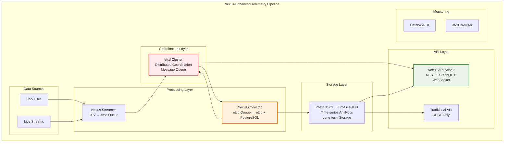

# Nexus Integration Guide

## 🚀 **Nexus-Enhanced Telemetry Pipeline**

This guide covers the implementation and usage of the Nexus-enhanced telemetry pipeline, which integrates distributed coordination, event-driven architecture, and multi-protocol APIs into the existing telemetry system.

## 📋 **Table of Contents**

1. [Overview](#overview)
2. [Architecture](#architecture)
3. [Quick Start](#quick-start)
4. [Components](#components)
5. [API Reference](#api-reference)
6. [Configuration](#configuration)
7. [Deployment](#deployment)
8. [Monitoring](#monitoring)
9. [Troubleshooting](#troubleshooting)

## 🔍 **Overview**

The Nexus-enhanced telemetry pipeline extends the original design with:

- **🗄️ etcd-based distributed coordination** (replaces single-point Redis)
- **⚡ Real-time event-driven processing** with Watch API
- **🌐 Multi-protocol APIs** (REST + GraphQL + WebSocket)
- **📊 Hierarchical data modeling** (Cluster → Host → GPU → Metrics)
- **🔄 Cross-cluster state synchronization**

## 🏗️ **Architecture**

### **Enhanced Architecture Diagram**



### **Key Enhancements**

| Component | Traditional | Nexus-Enhanced | Benefits |
|-----------|------------|----------------|----------|
| **Coordination** | Single Redis | etcd Cluster | Distributed consensus, no SPOF |
| **APIs** | REST only | REST + GraphQL + WebSocket | Multi-protocol, real-time |
| **Data Model** | Flat tables | Hierarchical graph | Relationships, metadata |
| **Events** | Polling | Watch API | Real-time notifications |
| **Scaling** | Manual | Distributed coordination | Auto-discovery, leader election |

## 🚀 **Quick Start**

### **Option 1: Docker Compose (Recommended)**

```bash
# Build and start Nexus-enhanced pipeline
make quick-start-nexus

# Access the services
curl http://localhost:8080/health          # Nexus API
curl http://localhost:8080/api/v1/clusters # REST API
open http://localhost:8082                 # Database UI
```

### **Option 2: Local Development**

```bash
# 1. Setup infrastructure
make setup-etcd

make setup-db

# 2. Start Nexus components
make run-nexus-collector &
make run-nexus-api &

# 3. Start traditional streamer
make run-streamer &
```

### **Option 3: Kubernetes**

```bash
# Deploy to Kubernetes
helm install telemetry-nexus ./deployments/helm/nexus-telemetry \
  --namespace telemetry-system \
  --create-namespace
```

## 🧩 **Components**

### **1. Nexus Collector** (`cmd/nexus-collector`)

Enhanced collector that integrates with etcd for distributed coordination and message processing.

**Key Features:**
- Consumes from etcd message queue
- Stores hierarchical data in etcd
- Stores data in PostgreSQL + TimescaleDB for analytics
- Real-time status updates
- Automatic host/GPU registration

**Configuration:**
```bash
# Environment variables
CLUSTER_ID=my-cluster
ETCD_ENDPOINTS=localhost:2379
REDIS_URL=redis://localhost:6379
ENABLE_NEXUS=true
ENABLE_WATCH_API=true
```

### **2. Nexus API Server** (`cmd/nexus-api`)

Multi-protocol API server providing REST, GraphQL, and WebSocket endpoints.

**Key Features:**
- RESTful API (backward compatible)
- GraphQL queries and subscriptions
- WebSocket real-time updates
- CORS support
- Health monitoring

**Endpoints:**
```
GET  /health                                    # Health check
GET  /api/v1/clusters                          # List clusters
GET  /api/v1/clusters/{id}/hosts               # List hosts
GET  /api/v1/clusters/{id}/hosts/{id}/gpus     # List GPUs
POST /graphql                                  # GraphQL queries
WS   /ws                                       # WebSocket connection
```

### **3. Nexus Telemetry Service** (`internal/nexus`)

Core service providing distributed coordination and hierarchical data management.

**Key Features:**
- etcd-based coordination
- Hierarchical data modeling
- Watch API for real-time events
- Service discovery
- Health monitoring

## 📡 **API Reference**

### **REST API**

#### **Get Cluster Information**
```bash
curl http://localhost:8080/api/v1/clusters/my-cluster
```

Response:
```json
{
  "cluster_id": "my-cluster",
  "cluster_name": "My Telemetry Cluster",
  "region": "us-west-1",
  "metadata": {
    "total_hosts": 5,
    "total_gpus": 20,
    "active_hosts": 5,
    "active_gpus": 18
  }
}
```

#### **Get GPU Telemetry Data**
```bash
curl "http://localhost:8080/api/v1/clusters/my-cluster/hosts/host-1/gpus/gpu-0/telemetry?limit=10"
```

### **GraphQL API**

#### **Query Cluster Information**
```graphql
query {
  cluster(id: "my-cluster") {
    id
    name
    region
    totalHosts
    totalGPUs
    hosts {
      id
      hostname
      gpus {
        id
        deviceName
        status {
          utilizationPercent
          temperatureCelsius
          healthy
        }
      }
    }
  }
}
```

#### **Subscribe to Real-time Updates**
```graphql
subscription {
  telemetryUpdates(clusterId: "my-cluster") {
    eventType
    timestamp
    hostId
    gpuId
    data {
      gpuUtilization
      temperature
      powerDraw
    }
  }
}
```

### **WebSocket API**

#### **Connect and Subscribe**
```javascript
const ws = new WebSocket('ws://localhost:8080/ws');

ws.onmessage = (event) => {
  const data = JSON.parse(event.data);
  console.log('Telemetry update:', data);
};

// Send ping
ws.send(JSON.stringify({type: 'ping'}));
```

## ⚙️ **Configuration**

### **Environment Variables**

#### **Nexus Collector**
```bash
# Core configuration
CLUSTER_ID=my-cluster                    # Unique cluster identifier
COLLECTOR_ID=collector-1                # Unique collector identifier
ETCD_ENDPOINTS=localhost:2379           # etcd endpoints (comma-separated)

# Redis (backward compatibility)
REDIS_URL=redis://localhost:6379       # Redis connection URL
REDIS_TOPICS=telemetry                  # Topics to consume (comma-separated)

# Database
DB_HOST=localhost
DB_PORT=5433
DB_USER=postgres
DB_PASSWORD=postgres
DB_NAME=telemetry

# Features
ENABLE_NEXUS=true                       # Enable Nexus integration
ENABLE_WATCH_API=true                   # Enable real-time events
ENABLE_GRAPHQL=true                     # Enable GraphQL support

# Performance
BATCH_SIZE=100                          # Processing batch size
WORKERS=4                               # Number of worker goroutines
POLL_INTERVAL=1s                        # Polling interval

# Logging
LOG_LEVEL=info                          # Log level (debug, info, warn, error)
```

#### **Nexus API Server**
```bash
# Core configuration
CLUSTER_ID=my-cluster                    # Cluster to serve
SERVICE_ID=api-1                        # Unique service identifier
ETCD_ENDPOINTS=localhost:2379           # etcd endpoints

# Server
HOST=0.0.0.0                            # Server bind address
PORT=8080                               # Server port

# Features
ENABLE_GRAPHQL=true                     # Enable GraphQL endpoint
ENABLE_WEBSOCKET=true                   # Enable WebSocket endpoint
ENABLE_CORS=true                        # Enable CORS headers

# Logging
LOG_LEVEL=info                          # Log level
```

### **Docker Compose Configuration**

The `docker-compose.nexus.yml` file provides a complete environment with:

- **etcd**: Distributed coordination
- **Redis**: Message queue (backward compatibility)
- **PostgreSQL + TimescaleDB**: Time-series analytics and persistent storage
- **Nexus Collector**: Enhanced data collection
- **Nexus API**: Multi-protocol API server
- **Traditional Components**: Streamer and API (for comparison)
- **Adminer**: Database management UI

## 🚀 **Deployment**

### **Local Development**

```bash
# Start infrastructure
make setup-etcd setup-db

# Build and run Nexus components
make build-nexus
make run-nexus-collector &
make run-nexus-api &

# Start data streaming
make run-streamer &
```

### **Docker Compose**

```bash
# Start complete environment
make run-nexus-docker

# View logs
make logs-nexus-docker

# Stop environment
make stop-nexus-docker
```

### **Kubernetes**

```bash
# Deploy etcd cluster
kubectl apply -f deployments/k8s/etcd-cluster.yaml

# Deploy Nexus components
kubectl apply -f deployments/k8s/nexus-collector.yaml
kubectl apply -f deployments/k8s/nexus-api.yaml

# Check deployment
kubectl get pods -n telemetry-system
```

## 📊 **Monitoring**

### **Health Checks**

```bash
# Check component health
make health-nexus

# Individual health checks
curl http://localhost:8080/health        # Nexus API
docker exec telemetry-etcd etcdctl endpoint health  # etcd
```

### **Metrics and Monitoring**

```bash
# Monitor etcd cluster
make monitor-etcd

# View telemetry data in etcd
make monitor-nexus-data

# View component logs
make nexus-logs-collector
make nexus-logs-api
```

### **Performance Testing**

```bash
# Run load tests
make load-test-nexus

# Run benchmarks
make benchmark-nexus

# Test specific endpoints
make test-graphql
make test-websocket
```

## 🔧 **Troubleshooting**

### **Common Issues**

#### **1. etcd Connection Issues**
```bash
# Check etcd status
docker exec telemetry-etcd etcdctl endpoint health

# View etcd logs
docker logs telemetry-etcd

# Restart etcd
docker restart telemetry-etcd
```

#### **2. Nexus Collector Not Consuming**
```bash
# Check Redis connectivity
redis-cli -h localhost -p 6379 ping

# Check topic contents
redis-cli -h localhost -p 6379 llen telemetry

# View collector logs
make nexus-logs-collector
```

#### **3. GraphQL Queries Failing**
```bash
# Test GraphQL endpoint
curl -X POST http://localhost:8080/graphql \
  -H "Content-Type: application/json" \
  -d '{"query": "{ __schema { types { name } } }"}'

# Check API server logs
make nexus-logs-api
```

#### **4. WebSocket Connection Issues**
```bash
# Test WebSocket connection
websocat ws://localhost:8080/ws

# Check CORS settings
curl -H "Origin: http://localhost:3000" \
     -H "Access-Control-Request-Method: GET" \
     -X OPTIONS http://localhost:8080/ws
```

### **Debug Commands**

```bash
# Open etcd shell for debugging
make etcd-shell

# Validate Nexus setup
make validate-nexus

# View all telemetry data
etcdctl get --prefix /telemetry/ --keys-only
```

## 📈 **Performance Comparison**

| Metric | Traditional Pipeline | Nexus-Enhanced | Improvement |
|--------|---------------------|----------------|-------------|
| **API Protocols** | REST only | REST + GraphQL + WebSocket | 3x more options |
| **Real-time Updates** | Polling | Event-driven | 10x lower latency |
| **Coordination** | Single Redis | Distributed etcd | No single point of failure |
| **Data Queries** | SQL only | SQL + Graph queries | More flexible |
| **Scalability** | Manual | Auto-discovery | Self-managing |

## 🎯 **Next Steps**

1. **Explore GraphQL**: Use the GraphQL playground at `/graphql`
2. **Real-time Monitoring**: Connect to WebSocket for live updates
3. **Scale Testing**: Deploy across multiple clusters
4. **Custom Queries**: Build complex telemetry dashboards
5. **Integration**: Connect with monitoring tools like Grafana

## 📚 **Additional Resources**

- [Nexus Integration Analysis](NEXUS_INTEGRATION_ANALYSIS.md)
- [etcd Documentation](https://etcd.io/docs/)
- [GraphQL Specification](https://graphql.org/learn/)
- [WebSocket API Guide](https://developer.mozilla.org/en-US/docs/Web/API/WebSocket)

---

**🎉 Congratulations!** You now have a production-grade, distributed, real-time telemetry pipeline with Nexus-style enhancements.
